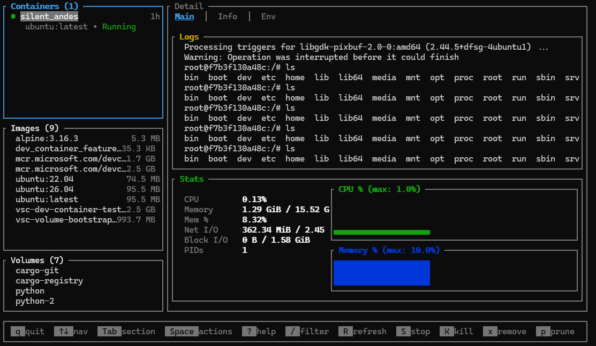

# 🐧 lazywslc

A [**lazydocker-inspired**](https://github.com/jesseduffield/lazydocker) TUI dashboard for managing WSL Linux containers via `wslc.exe`.



## Features

- Three-panel layout for Containers, Images, and Volumes
- Live CPU/memory sparkline graphs
- Combined logs and stats view
- Mouse and keyboard support
- Context actions (start/stop/kill/remove/prune)
- Auto-refresh

## Install

With [WinGet](https://learn.microsoft.com/windows/package-manager/):

```powershell
winget install crloewen.lazywslc
```

Or grab the latest `.msi` or `.exe` from the [Releases](https://github.com/craigloewen-msft/lazywslc/releases) page.

## Contribute

Feel free to fork and open PRs!

## License

MIT
